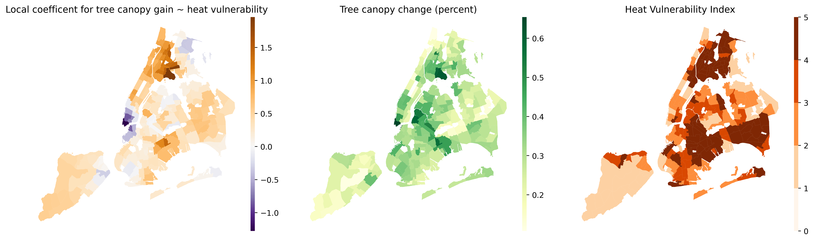
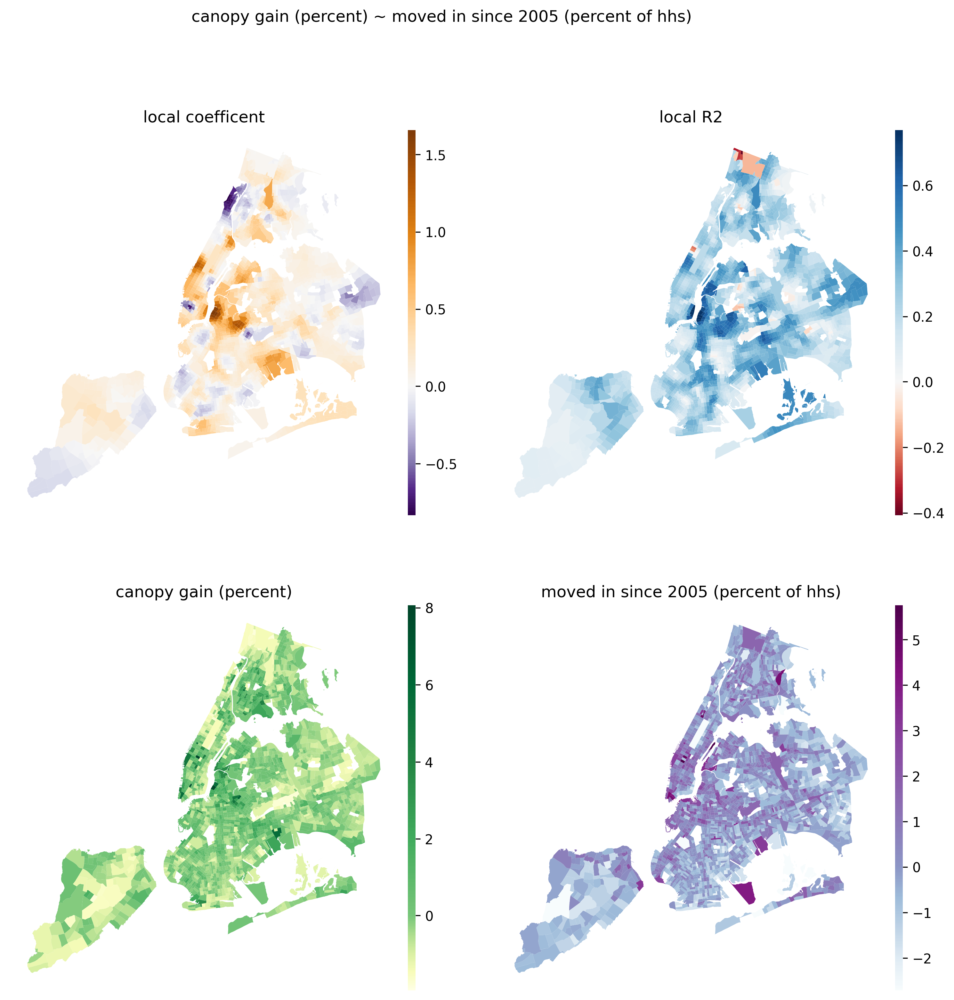

# Is the change in tree canopy cover equitable in climate-changing New York City?: Exploring the data

### Extreme heat is a growing and unequal threat
Though often overlooked, **extreme heat is one of the most dangerous weather conditions facing New York City**. More Americans die each year from [heat waves](https://www.cdc.gov/climateandhealth/pubs/extreme-heat-guidebook.pdf) than all other extreme weather events combined. Climate change is projected to [double](https://nyaspubs.onlinelibrary.wiley.com/doi/full/10.1111/nyas.12653) the number of days over 90 degrees in New York City by the 2050s. 

**The city landscape [absorbs and retains extra heat](https://www.epa.gov/heatislands)**, which exacerbates the effects of high air temperatures. This ‘urban heat island’ effect is most pronounced in areas without shading tree canopy and, instead, pavement and buildings that take in extra heat.

**The risks of extreme heat are borne inequitably by New Yorkers.** The physical landscape of the city means areas with less tree cover and more pavement get as much as [30 degrees hotter](https://www.nytimes.com/2021/08/20/nyregion/climate-inequality-nyc.html). Moreover, residents facing economic and other disadvantages are more likely to lack access to air conditioning and to have comorbidities that add to heat stress. 

### Tree cover is a vital block against extreme heat
**New York City has undertaken a substantial tree-planting campaign** over the past decade to mitigate the harms of climate change (and to offer many more benefits). The public-private ‘MillionTrees NYC’ project launched in 2011 and reached its goal two years ahead of schedule, planting its [millionth tree](https://www.nycgovparks.org/parks/joyce-kilmer-park/dailyplant/23507) in 2015. The program was such a success that there are calls from across the political spectrum for a [new investment](https://www.nytimes.com/2022/02/12/nyregion/trees-parks-nyc.html) in new trees citywide.

At the same time, the past decade has seen **a wave of new construction** in many neighborhoods and this new urban growth may have cut away at tree canopy cover.

This analysis explores how change in tree canopy in recent years correlates with the socio-economic factors that determine which areas are most vulnerable to heat stress. Specifically, it explores whether tree canopy change correlates with heat vulnerability and other neighborhood demographic and economic factors. 

## Data

_LiDAR imagery used to generate tree canopy data. Source: NYC DoITT_

- Tree Canopy Change 2010-2017. This dataset shows the change in tree canopy cover from 2010 to 2017. The information was sourced from LiDAR collected in each year, then processed through classification algorithms to detect tree cover, then further adjusted to better represent the accurate change in canopy (removing artifacts from changes in technology and processing between the two data collection periods). Data are stored as vector polygons classified as ‘gain’, ‘loss,’, or ‘no change’  The data is published by NYC DOITT on [NYC Open Data](https://data.cityofnewyork.us/Environment/Tree-Canopy-Change-2010-2017-/by9k-vhck).
- Heat Vulnerability Index. This composite measure, compiled by the New York State Department of Health, combines physical data on local temperature risk and social and economic measures to quantify the population’s vulnerability to heat stress. The finest-grain data is available at the Neighborhood Tabulation Area (NTA) scale. The data were compiled in 2018. Time series data have not been computed, which somewhat limits the explanatory power of these data for this study. However, the component parts of the index are available for other time periods, so a further analysis on this topic could compute HVI at different time periods. Data were taken from NYS [Environment & Health Data Portal](https://a816-dohbesp.nyc.gov/IndicatorPublic/VisualizationData.aspx?id=2411,719b87,107,Summarize).
- Census data. In addition to the HVI, I considered several other socio-demographic data points thought to be proxy measures for power or precarity. I took the following data, at the Census Tract level from 2010, from [data.census.gov](https://data.census.gov): 
    - Racial demographics (percent White, percent Black, percent Asian, percent Hispanic or Latino (of any race))
    - Median income
    - Housing tenure (percent of households that are owner-occupied, percent that are renters, and percent that moved into their current home since 2005)
    - Housing cost (Median home value and median rent)
    - Percent of households that are rent-burdened (spending more than 35 percent of household income on rent)
    - Building type and age (Percent of households that are in single-family houses, percent of households in buildings built since 2000)
- Census Tract areas. I used two versions of 2010 Census tract geometries: 
    - With geometries clipped to the shoreline (to represent actual land area),, available from NYC Planning [Bytes of the Big Apple](https://www1.nyc.gov/site/planning/data-maps/open-data/bytes-archive.page).  
    - With geometries extending into the water (so that areas on opposite sides of (for instance) the East River or Newtown Creek are topologically adjacent),  from [Census TIGER](https://www.census.gov/geographies/mapping-files/time-series/geo/tiger-line-file.2010.html).
- Neighborhood Tabulation Area (NTA) geometries. I used 2010 NTA geometries from NYC Planning [Bytes of the Big Apple](https://www1.nyc.gov/site/planning/data-maps/open-data/bytes-archive.page). 

## Methods

This study uses a variety of spatial analysis methods to consider the aggregate amount of tree canopy and its fragmentation, and how each measure relates to heat vulnerability and other socio-economic factors.

#### Data processing
I computed several measures of canopy cover and change in canopy cover for each Census Tract area and NTA to use as outcome variables.

To process the large canopy change dataset, I create a script to iteratively open a subset of the geometries within each area, clip them to the area borders, then sum the area attributes of each of the three classes (‘no change’, ‘loss’, and ‘gain’). From these sums I further computed the total canopy area in 2010 (equal to the ‘no change’ area plus the ‘loss’ area), the total in 2017 (‘no change’ plus ‘gain’), the net gain or loss, the gain and loss as a percent of the total in 2010, and the canopy area in each year as a percentage of the total area. Additionally, I fit a linear model between the canopy area in 2010 and 2017 and took the residual of this model as an additional measure of relative canopy loss or gain. 

I joined data from the Census and the Heat Vulnerability Index to the canopy measures by, respectively, tracts and NTA.

#### Exploratory regression
I used several methods to check for relationships between variables, and to see what demographic or economic measures may relate to canopy gain or loss.

A correlation heatmap showed the degree to which each pair of variables generally trend in the same direction. A grid of scatterplots allowed a scan of which pairs of variables might show a functional relationship; however, few pairs showed any clear patterns (see figure 1)

_Figure 1: 2-dimensional histogram plots between each pair of variables. Few linear relationships observed._ 

Exploratory regressions, conducted using ArcMap, tested each permutation of explanatory variables. In general, these models showed little fit, with the best only reaching R^2 values of 0.1.

I tested linear models and plotted data for a few of the pair relationships that suggested correlations. Again the linear relationships were not strong (R^2 values below 0.1). However, tree canopy gain (percentage) showed a significant negative relationship with both percent of households owner occupied, and median income (although The plot of the latter suggested the relationship was non-linear and may turn positive at higher incomes). 

#### Tests for spatial autocorrelation
Spatial autocorrelation violates the assumptions that underpin ordinary least squares regression and can cause erroneous results. Using the `esda` package, I tested all variables for spatial autocorrelation, using first-order Queen contiguity as a measure of nearness. I computed Moran’s _I_ and Geary’s _c_ values for each variable, the latter to be sure that outlier variable values were not skewing the I scores. 

_Figure 2: Spatial autocorrelation for variables measured by Moran’s_ I

Unsurprisingly, each factor exhibited some degree of spatial autocorrelation (see Table 1). The greatest spatial autocorrelation was shown for measures of racial demographics, providing additional evidence for the enduring patterns of racial segregation. Interestingly, all demographic factors and most housing factors showed greater spatial autocorrelation than the measures of tree canopy. The relatively greater dissimilarity in tree canopy between neighboring areas suggests that there are more specific, localized factors affecting the gain or loss of tree cover.

#### Geographically weighted regression
The OLS fits between various potential variables were not strong, but this may be because of the detected autocorrelation in the variables. A spatial pattern or clustering would detract from the ability of a linear model to accurately model a uniform the relationship citywide.

I used geographically weighted regressions to model localized relationships between variables and check for clusters or local areas of divergent relationships.

I tested each pairwise relationship between tree canopy and demographic/economic factors. I tested only univariate models in order to allow for straightforward interpretation of the results, because my explanatory variables are related and likely would introduce some multicollinearity, and because the exploratory regression analysis showed no multivariate linear models that performed much better than any univariate models.

I first standardized the data and computed centroids of each Census area. For each pairwise relationship, using the `mgwr` package, I computed the optimal bandwidth with a parameter search using an adaptive nearest-neighbor bi-square kernel, optimizing for AICc, as [suggested](https://doi.org/10.3390/ijgi8060269) by Oshan, et al. I then fit the geographically weighted regression, reported out the pseudo-R^2 and AIC as measures of model fit, and mapped the local coefficients to observe local clusters and patterns. I developed a custom function to generate GWR models, map the results, and report performance, which allowed rapid testing of a number of possible relationships. 

To test the effect of distance on the relationships, I reran GWRs at alternate bandwidths. The optimal bandwidths were between 45 and 52 nearest neighbors, I specified instead the 10 nearest neighbors the 100 nearest neighbors. As expected, the smaller bandwidth brought out more unique, high (absolute) coefficient relationships, while the large bandwidth multiplied the effects across a wider area. A bandwidth of 10 yielded considerably higher pseudo-R2 values, but performed more poorly as measured by AIC (see Table 1). A smaller neighborhood offers a strong linear fit at each location, but the lower AIC indicated this model may be overfitting the data.

## Findings

With this geographically weighted regression exploration I found several local patterns suggesting locally-unique relationships between neighborhood characteristics and tree canopy change.

1) In most of the city, there was a locally stronger positive relationship between heat vulnerability and canopy gain. The connection is especially strong in eastern Queens and upper Manhattan (based on local R^2 values). The strongest localized effects are the south Bronx, where canopy gain is most positively correlated with Heat Vulnerability Index, and in lower Manhattan, where the relationship is reversed. South Bronx residents have the highest heat vulnerability in the city, and this neighborhood saw one of the largest gains in tree canopy. Lower Manhattan’s wealthy residents have low heat vulnerability, but this neighborhood also gained substantial tree cover (on a percentage basis). (see figure 3)

_Figure 3: (i) Local coefficient for tree canopy gain based on heat vulnerability, (ii) tree canopy gain (percentage), standardized, (iii) Heat Vulnerability Index (higher values equal indicate higher vulnerability)._ 

2) In Williamsburg, Bushwick, and the middle west side of Manhattan, canopy gain is more positively associated with the portion of the population that has moved in since 2005. Although these areas have all seen much new construction over the past decade, they generally show above-average percentage canopy gain (see Figure 4). The locally positive relationship could indicate that more tree cover is added in gentrifying areas, or indicate that as areas are converted from industrial to residential zones, tree canopy is expanded.

_Figure 4: (i) local relationship between canopy gain (as percent of 2010 canopy) and percent of households that moved in to their residence since 2005. (ii) local R^2 value of GWR model, (iii) canopy gain (percent), (iv) moved in since 2005 (percent of households). Scales on (i), (iii), and (iv) are standard deviations from the mean variable value._

3) The portion of rent-burdened households is a negative indicator of tree canopy gain in the southern half of Manhattan, but this appears to be because there are actually a smaller portion of rent-burdened households in these high-cost areas, and larger-than-average percentage gains in tree cover (see Figure 5). (The local R^2 also shows a not-particularly-good fit between these variables in this outlier area.)

_Figure 5: (i) local relationship between canopy gain (as percent of 2010 canopy) and percent of households that are rent burdened (paying more that 35 percent of income on rent). (ii) local R^2 value of GWR model, (iii) canopy gain (percent), (iv) rent burdened (percent of households). Scales on (i), (iii), and (iv) are standard deviations from the mean variable value._

4) Property values from 2010 are more correlated with tree canopy gain in the eastern Bronx, and southeast Brooklyn and Queens (all areas that are also at greater heat vulnerability). These areas have lower property values and lower canopy gain. An area near East New York has a locally opposite pattern, with low property prices but much-greater-than-average canopy gain. These patterns were more apparent at a bandwidth of 100 nearest neighbors, which smooths other anomalous areas. (see Figure 6).

_Figure 6: (i) local relationship between canopy gain (as percent of 2010 canopy) and home value. (ii) local R^2 value of GWR model, (iii) canopy gain (percent), (iv) median home value. Scales on (i), (iii), and (iv) are standard deviations from the mean variable value. Bandwidth = 100 nearest neighbors._

Staten Island shows the opposite pattern, with property values serving as a locally negative indicator of canopy gain. Although Staten Island’s more expensive properties are in leafier areas, the net change in canopy area is also especially correlated with home value on the Island, in contrast to other outlying areas in northeastern and southern Queens where higher home prices indicate net canopy loss. (see Figure 7). (Separate tests for correlation between the portion of single family homes and tree canopy did not show consistent patterns.) It should also be noted that many tracts, particularly in core areas, are missing data on home prices, which may skew this observation.

_Figure 7: (i) local relationship between net canopy change and home value. (ii) local R^2 value of GWR model, (iii) net canopy change, (iv) median home value. Scales on (i), (iii), and (iv) are standard deviations from the mean variable value. Bandwidth = 100 nearest neighbors. _

#### Evaluation of fragmentation

In addition to the aggregate area of tree canopy, I further computed the fractal dimension of tree canopy in each area for 2010 and 2017. 

Tree canopy cover is an example of natural fractal patterning and the fractal dimension describes the degree of fragmentation of the canopy. This is an important measure, as [fragmentation](https://www.fs.usda.gov/treesearch/pubs/10234) can indicate a less healthy urban forest and isolated trees provide less cover and shade than a tightly connected canopy. Connected sections of urban forest may be [more effective](https://www.sciencedirect.com/science/article/pii/S0143622817301935) than isolated patches at mitigating heat effects. On the other hand, high fractal dimension of the area _not_ under canopy indicates large expanses without cooling trees or possibly without shade at all, which could also exacerbate the heat island effect.

I again clipped the tree canopy within each Census Tract, then computed geometries for the total tree canopy in each year, and also added a geometry representing the total area not under canopy (this was necessary to distinguish the non-canopy area from the no-data area outside the tract boundary once the geometry is recast into a raster format). I created raster files at 1-ft resolution with the presence or absence of canopy for each year. Then I used the `landscapemetrics` package in `R` to implement a box-counting method to [estimate](https://r-spatialecology.github.io/landscapemetrics/) the fractal dimension for each area and each year. The Census Tract fractal dimension scores were then joined to other Tract data. Because this process was computationally intensive, I restricted the scope to only Manhattan for this study. With additional computing time, the process could easily be extended citywide. 

I repeated the geographically-weighted regression process to test the local patterns in the relationship between canopy connectedness and socio-economic factors.

The most interesting finding is that canopy connectedness is most strongly associated with new construction in lower Manhattan (specifically, right around NYU). This area has more residents in new buildings and also has seen the tree canopy become more fragmented than elsewhere in Manhattan (see figure 8).

_Figure 8: (i) local relationship between change in tree canopy connectedness (fractal dimension) and portion of households in buildings built since 2000 . (ii) local R^2 value of GWR model, (iii) change in tree canopy connectedness (fractal dimension) (iv) portion of households in buildings built since 2000. Scales on (i), (iii), and (iv) are standard deviations from the mean variable value._

## Conclusions and opportunities for further research

This exploratory study finds some relationships between social and economic factors and tree canopy change, while also showing a great degree of heterogeneity in the patterns across the city.

This location-specific analysis could help identify areas of unique vulnerability in which to prioritize tree planting as a climate mitigation strategy. 

McDonald, et. al (2021) identified significant [relationships between urban heat island and income](https://doi.org/10.1371/journal.pone.0249715), an effect most pronounced in Northeast cities. That study uses spatially coarser, satellite data; the fine-grained canopy used here, as well as the additional fractal measure of canopy connectedness, could extend this research. 

Bosch, et. al (2021) pointed to the [specific patterns of urban tree canopy](https://doi.org/10.1098/rsos.202174) which most mitigate heat exposure. Such a form-specific analysis of New York’s tree canopy could identify places where additional tree canopy could most reduce heat vulnerability. 
